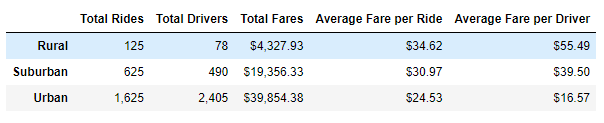
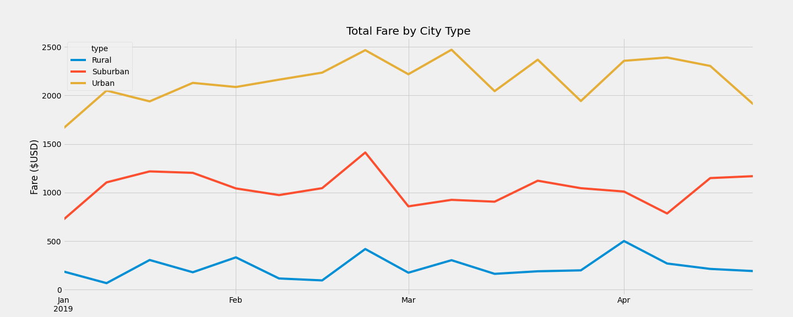

# PyBer_Analysis

## Project Overview
Ridesharing company, PyBer, has provided their rideshare data from January to early May 2019. This includes data from three city types: Urban, Suburban, and Rural cities, as well as the dates, number of drivers, and fare amount for each ride. I've been asked to create a summary of this data as well as weekly fare data for each of the three city types.

## Results
The following numbers represent totals and averages performed on various pieces of the ridesharing data, comparing the three city types: Urban, Suburban, and Rural cities. We can see these summed up in the following Pandas DataFrame:

#### Total Rides
- Rural: 125
- Suburban: 625
- Urban: 1,625

Here we can see that Urban cities have a total of around 2.6 and 13 times as many rides as Suburban and Rural rides (respectively).

#### Total Drivers
- Rural: 78
- Suburban: 490
- Urban: 2,405

Here we can see that Urban cities have a total of around 4.9 and 30.8 times as many drivers as Suburban and Rural rides (respectively).

#### Average fare per ride and driver
- Per Ride
  - Rural: $34.62
  - Suburban: $30.97
  - Urban: $24.53

Here we can see that Rural cities average fare per ride is around 1.1 and 1.4 times greater than Suburban and Urban rides (respectively).

- Per Driver
	- Rural: $55.49
	- Suburban: $39.50
	- Urban: $16.57

Here we can see that Rural cities average fare per driver is around 1.4 and 3.3 times greater than Suburban and Urban rides (respectively).

#### Total Fares by City Type
- Rural: $4,327.93
- Suburban: $19,356.33
- Urban: $39,854.38

Here we can see that Urban cities total fares is around 2.1 and 9.2 times greater than Suburban and Rural totals (respectively).

With the total fares by city type, we can also see how these stack up weekly, using the following multiple line graph.

This graph creates a clear visual to see how much more urban cities make than suburban cities, which make more than rural cities. We can also see spikes in all three city types in early March. There doesn't seem to be any other significant spikes or drops in total weekly fares at any other time of year.

## Summary

1. There is a correlation between having lower fare per ride and having more total rides. To increase number of rides in suburban and rural cities, PyBer could decrease the fare per ride in these areas.

2. Alternatively, there is a correlation between higher average fares per ride and higher average fares per driver. To increase fare per driver, PyBer could instead increase the fare per ride in Urban areas. Although this may decrease the total number of rides.

3. A third correlation we can see is that the more drivers, the more rides. To increase ridership in Rural and Suburban areas, PyBer could hire more drivers in those areas (although there may be other factors affecting these, such as lower need for ridesharing in Rural areas due to lower populations.)
